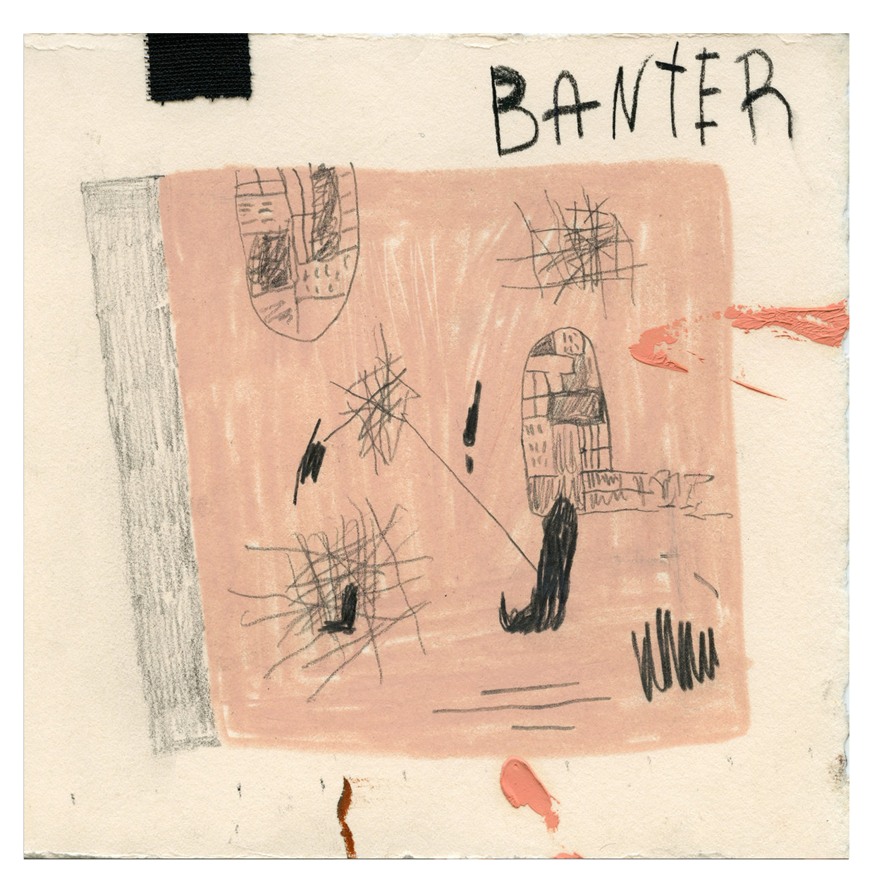

<!Doctype HTML>
<!DOCTYPE html>
<html>
<head>
	<link href="reset.css" rel="stylesheet">
	<link href="style.css" rel="stylesheet">
	<title></title>
</head>
<body>
	<header>
		<a href="index.html">
		
	</header>
	<h1><a href="section.html" class="nav-link">MUSIC</a> ART FASHION LIFESTYLE EVENTS PHOTOS</h1>
	<h2>
	<a href="http://banter0.bandcamp.com/album/banter" target="_blank">
	
	</h2>
	
<u>RECENT POSTS</u>

	<ul style="float: left; clear: left">
		<li><a href="article.html" class="nav-link"><i>2-27-16 // BANTER ALBUM RELEASE PARTY</i></li>
		<li><i>2-20-16 // TLOP CRITIQUE</i></li>
		<li><i>1-16-16 // MELLO NIGHT IN</i></li>
		<li><i>11-13-15 // JAMES TURRELL:RODEN CRATER</i></li>
	</ul>
</body>
</html>

